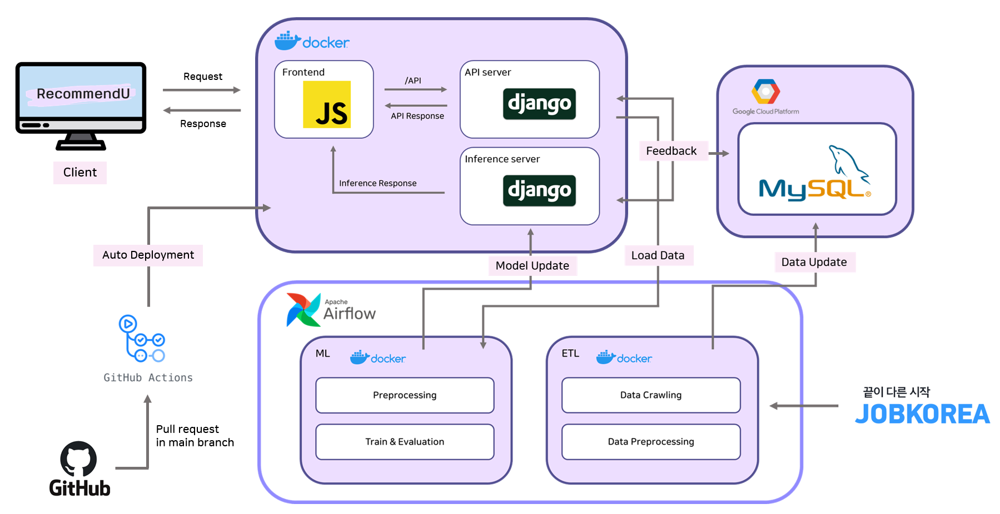
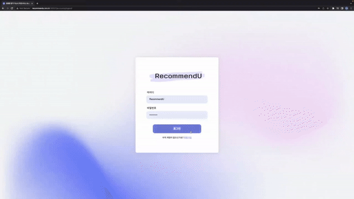
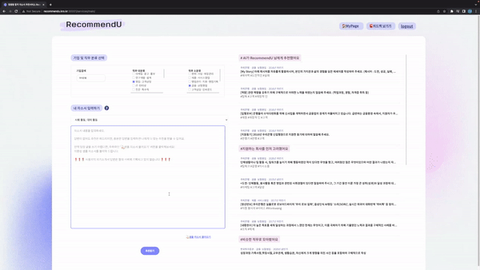
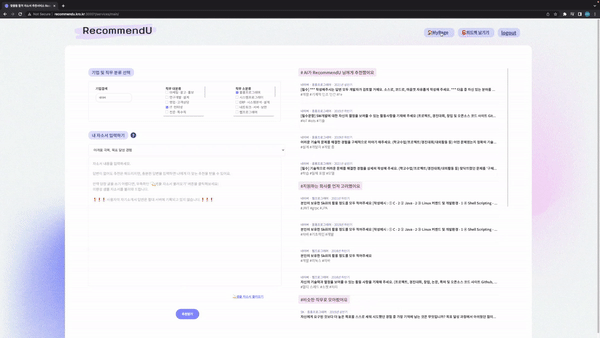

# 맞춤형 자기소개서 추천 서비스: RecommendU

<a href="https://www.youtube.com/watch?v=rrT9dR9fZ4w">  <a href="https://www.notion.so/boostcampait/RecSys-06-RecommendU-4922b47ab8424b51b878a9ff5a57cc9c?pvs=4">

사용자 맥락을 반영하여 다양한 추천 태그를 통해 합격 자기소개서를 추천해주는 서비스 RecommendU입니다.

## 🎯 Overview
합격 자기소개서를 참고하고 싶을 때 **자신의 상황에 적합한 합격 자기소개서**를 찾는 것에 어려움을 겪은 팀원들의 공감대에서 시작하게 되었습니다. 

이는 부스트캠프, 오픈채팅, 스팩업 등의 커뮤니티에 자체 설문조사를 진행한 결과 응답자의 90.6%가 자기소개서를 작성하면서 어려움을 느껴 합격 자소서를 찾아본 적이 있다는 결과로 확인해볼 수 있었습니다.

그리고 합격 자소서를 찾아보면서 **자신이 작성하는 내용과 비슷한 내용을 찾기 어려웠고**, 자소서가 문항 단위로 나뉘어져 있지 않아 **유사 문항의 답변을 곧장 찾기 어려웠다**는 것도 알 수 있었습니다. 또한 기존 구직 플랫폼은 스크랩/인기도와 같이 **popularity 기준으로만 정렬**되어 자신에게 알맞은 자기소개서를 찾는 데 어려움을 겪었습니다.

## 🚩 Service Repository

### [FE/BE]

Go ▶️ [**[recommendu-web]** repository](https://github.com/boostcampaitech4lv23recsys1/RecommendU-web)

### ETL

Go ▶️ [**[recommendu-etl]** repository](https://github.com/boostcampaitech4lv23recsys1/RecommendU-etl)

### ML 

Go ▶️ [**[recommendu-ml]** repository](https://github.com/boostcampaitech4lv23recsys1/RecommendU-ml)
## 🚀 Architecture

## 📌 About RecommendU

### 로그인 및 회원가입
- 회원가입 기능을 구현하여 추천에 사용할 간단한 유저의 개인 정보를 수합.

### 입력 및 추천 클릭
- 추천된 문항을 클릭했을 때, **자기소개서 문항으로 연결**
- 유저의 관심 **회사, 분야, 직무, 질문**를 입력으로 받아 추천

### 답변이 있을때 클릭
- 유저가 자기소개서에 작성할 토픽이나 미완성된 작성 내용이 있다면 유사도를 계산하여 추천
- 작성 내용에 “교육 봉사 경험”에 대해 추가할 경우 **교육 봉사와 관련된 자기소개서 추천**

### 마이 페이지
- 마이 페이지 내에서 회원가입에 작성한 **정보**를 **변경 가능**
- 마이페이지에서 **스크랩한 자기소개서를 확인 가능**

## ⭐ Members
|  |  |  |  |  |
| :--------------------------------------------------------------------------------------: | :----------------------------------------------------------------------------------------------: | :--------------------------------------------------------------------------------------: | :--------------------------------------------------------------------------------------: | :--------------------------------------------------------------------------------------:
|                          [김유진](https://github.com/hello-im-yj)                           |                            [신희재](https://github.com/hwanseung2)                             |                        [유환승](https://github.com/hwanseung2)                           |                          [장윤성](https://github.com/JangYunSeong)                           |                            [정민주](https://github.com/jeongminju0815) 

## Thanks to UI/UX
|  |
| :--------------------------------------------------------------------------------------: |
|                          [우영연](https://github.com/ooner1999)                           |

